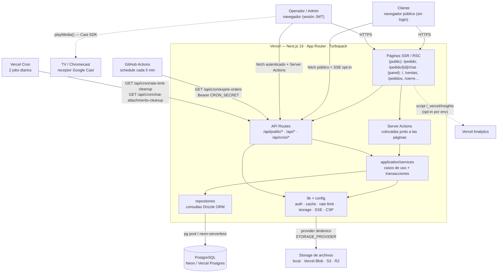

# Arquitectura del sistema Panchería

**Estado:** implementado
**Fecha de verificación:** 2026-10-02 (contra el código en `main`; `base-de-datos.md` incluye `notes` de la migración `0034`)
**Alcance:** documentación de la arquitectura **real** verificada en código. No modifica comportamiento funcional. Para reglas de negocio detalladas ver [guia-funcionamiento-pancheria.md](../guia-funcionamiento-pancheria.md).

## Qué es esto

Un mapa navegable de la arquitectura del proyecto en **tres niveles**, mantenido como texto (Markdown + Mermaid) versionado en Git. La fuente de verdad de cada diagrama es el bloque `mermaid` embebido en el `.md`; [`diagramas/svg/`](diagramas/svg/) contiene los renders `.svg` para vista rápida.

## Cómo navegar

| Nivel | Documento | Qué responde |
| --- | --- | --- |
| **1 — Sistema** | [overview.md](overview.md) | Qué es el sistema, quiénes lo usan, con qué servicios externos convive. |
| **2 — Módulos** | [modulos.md](modulos.md) | Cómo se organiza el código: capas, módulos funcionales, superficie API. |
| **3 — Detalle** | [base-de-datos.md](base-de-datos.md) | Modelo ER completo: 18 tablas, 10 enums, FKs, índices, borrado. |

Documentos transversales:

- [flujo-pedidos.md](flujo-pedidos.md) — ciclo de vida del pedido (`pending → in_process → paid → finished | cancelled`).
- [flujos-de-datos.md](flujos-de-datos.md) — 5 flujos punta a punta (pedido, venta, cierre de caja, chat, uploads).
- [servicios-externos.md](servicios-externos.md) — clasificación de integraciones: `USED` / `CONFIGURED` / `DOCUMENTED ONLY` / `UNKNOWN`.
- [stack.md](stack.md) — tecnologías y versiones detectadas.
- [salud-arquitectura.md](salud-arquitectura.md) — observaciones de salud (sin propuestas de cambio).

## Vista de nivel 1



> Render: [diagramas/svg/overview.svg](diagramas/svg/overview.svg)

## Datos rápidos

- **Una sola aplicación** Next.js 16 (App Router, runtime Node.js) desplegada en Vercel. No hay backend separado ni microservicios.
- **Dos canales de mutación:** API Routes (`/api/*`, consumidas por componentes cliente) y Server Actions colocadas en `(panel)/` y `(auth)/login` (operaciones de formulario del panel).
- **Multi-sucursal lógico:** toda la data cuelga de `branches`; el scope del operador es su `branchId` de sesión; el admin puede operar sobre cualquier sucursal con una cookie de sucursal activa (`ACTIVE_BRANCH_COOKIE`).
- **PostgreSQL** con Drizzle ORM; driver dual: `pg.Pool` o `@neondatabase/serverless` según la URL (`src/db/index.ts`).
- **Pagos:** `cash` y `transfer` únicamente. **Mercado Pago no está implementado** (cero referencias en `src/`).
- **Crons divididos:** Vercel Cron (2 jobs diarios de limpieza) + GitHub Actions (expiración de pedidos cada 5 min) — ver [servicios-externos.md](servicios-externos.md).

## Mantenimiento del mapa

Regenerar/actualizar cuando cambie:

1. `src/db/schema.ts` → actualizar [base-de-datos.md](base-de-datos.md) y regenerar `diagramas/svg/base-de-datos.svg`.
2. `src/app/api/**` o Server Actions → actualizar [modulos.md](modulos.md).
3. `vercel.json` / `.github/workflows/` → actualizar [overview.md](overview.md) y [servicios-externos.md](servicios-externos.md).
4. `package.json` → actualizar [stack.md](stack.md).
5. `src/lib/storage.ts`, `src/lib/server-cache.ts`, `src/lib/rate-limit*` → actualizar [flujos-de-datos.md](flujos-de-datos.md) y [modulos.md](modulos.md).

Validar sintaxis y regenerar un `.svg` tras editar un bloque `mermaid`: volcar el bloque a un `.mmd` temporal y correr (sin instalar dependencias del proyecto):

```bash
npx -y -p @mermaid-js/mermaid-cli mmdc -i %TEMP%\<archivo>.mmd -o .devin/informes/arquitectura/diagramas/svg/<archivo>.svg
```

Este mapa es **referencia viva**: no se archiva, se actualiza.
