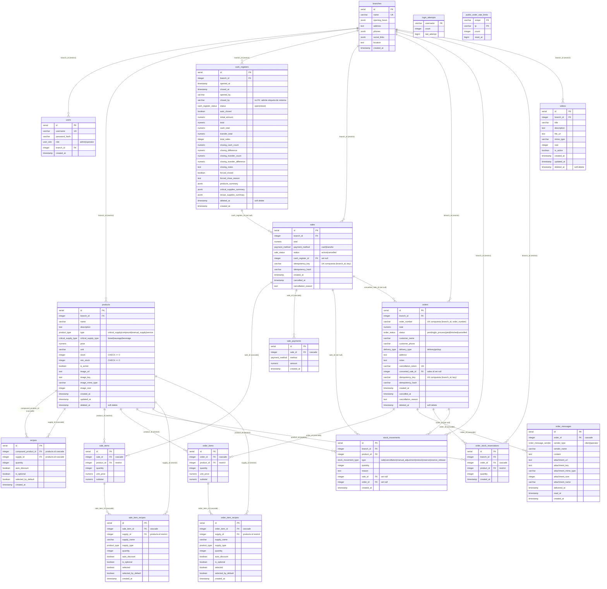

# Base de datos — Nivel 3: modelo ER completo

**Estado:** implementado
**Fuente de verdad:** [`src/db/schema.ts`](../../../src/db/schema.ts) (18 tablas, 10 enums) + migraciones `drizzle/`
**Motor:** PostgreSQL — driver `pg.Pool` o `@neondatabase/serverless` elegido en runtime por URL (`src/db/index.ts`). Migraciones con `drizzle-kit` (`drizzle.config.ts`, `out: ./drizzle`).

## Diagrama ER completo

> Fuente regenerable: [diagramas/base-de-datos.mmd](diagramas/base-de-datos.mmd)

## Enums (10)

| Enum | Valores | Uso |
| --- | --- | --- |
| `product_type` | `critical_supply`, `compound`, `manual_supply`, `service` | `products.type`, `*_item_recipes.supply_type` |
| `critical_supply_type` | `bread`, `sausage`, `beverage` | `products.critical_supply_type` |
| `payment_method` | `cash`, `transfer` | `sales.payment_method`, `sale_payments.method` |
| `sale_status` | `active`, `cancelled` | `sales.status` |
| `order_status` | `pending`, `in_process`, `paid`, `finished`, `cancelled` | `orders.status` |
| `order_message_sender` | `client`, `operator` | `order_messages.sender_type` |
| `delivery_type` | `delivery`, `pickup` | `orders.delivery_type` |
| `stock_movement_type` | `sale`, `cancellation`, `manual_adjustment`, `restock`, `reserve`, `reserve_release` | `stock_movements.type` |
| `cash_register_status` | `open`, `closed` | `cash_registers.status` |
| `user_role` | `admin`, `operator` | `users.role` |

> ⚠️ Histórico: las migraciones `0008`/`0009` mencionan `order`/`order_cancellation` en `stock_movement_type`; el enum fue recreado en `0009` y los valores actuales son solo los 6 listados. La guía de funcionamiento está desactualizada en este punto (ver `salud-arquitectura.md` §Discrepancias).

## Catálogo de tablas (18)

### Núcleo de negocio

| Tabla | Rol | Claves e índices relevantes |
| --- | --- | --- |
| `branches` | Sucursal (raíz del multi-tenant lógico). JSONB: `opening_hours`, `phones`, `social_links` | `name` UNIQUE |
| `users` | Operadores/admin. `password_hash` bcrypt | `username` UNIQUE, `branch_id` → branches (restrict) |
| `products` | Productos e insumos. Tipado por `type`; imágenes en storage (`image_*`) | idx `(branch_id, is_active, deleted_at)`, `(branch_id, type, is_active, deleted_at)`, `name`, `image_key`; CHECK `stock>=0`, `min_stock>=0` |
| `recipes` | Receta: insumo (`supply_id`) que compone un producto `compound` | FKs cascade a `products` ×2; idx por ambas FK |
| `cash_registers` | Cajas por turno. Resúmenes congelados en JSONB al cerrar | **Unique parcial**: una sola `open` por `branch_id` con `deleted_at IS NULL`; idx `status`, `opened_at`, `(branch_id,status,deleted_at)` |
| `sales` | Venta (cabecera). `idempotency_key` por sucursal | UNIQUE `(branch_id, idempotency_key)`; idx `created_at`, `(branch_id,created_at)`, `(cash_register_id,created_at)` |
| `sale_items` | Línea de venta | cascade a `sales`; `product_id` restrict |
| `sale_payments` | Pagos multi-parte de la venta | cascade a `sales` |
| `sale_item_recipes` | **Snapshot** de la receta al vender (insumo, qty, selected) | cascade a `sale_items`; `supply_id` restrict |
| `orders` | Pedido público. `cancellation_token` = credencial del cliente | UNIQUE `cancellation_token`; UNIQUE `(branch_id, order_number)`; UNIQUE `(branch_id, idempotency_key)`; idx `status`, `created_at`, `customer_name`, `customer_phone`, `converted_sale_id` |
| `order_items` | Línea de pedido | cascade a `orders`; `product_id` restrict |
| `order_item_recipes` | **Snapshot** de receta en pedido | cascade a `order_items`; `supply_id` restrict |
| `order_stock_reservations` | Reserva de stock de pedidos `in_process` | cascade a `orders`; idx `(branch_id, product_id)` |
| `order_messages` | Chat del pedido (texto/adjunto/ubicación) | cascade a `orders`; idx `(order_id, created_at)`, `(order_id, sender_type, read_at)`, `attachment_key` |
| `stock_movements` | Auditoría de stock (venta, anulación, ajuste, restock, reserva, liberación) | `sale_id`/`order_id` set null; idx `(branch_id, product_id, created_at)` |
| `videos` | Videos para cartelera/Cast. `file_url` apunta al provider | idx `(branch_id, is_active, deleted_at)` |

### Tablas de infraestructura (rate limiting)

| Tabla | Rol |
| --- | --- |
| `login_attempts` | Contador de intentos fallidos por `username` (PK). `last_attempt` epoch ms. Purga: `rate-limit-cleanup` |
| `public_order_rate_limits` | Contador por `(scope, ip)` compuesta PK (scopes: `order`, `chat`, `login_ip`, …). `reset_at` epoch ms. Purga: `rate-limit-cleanup` |

## Reglas de integridad y borrado

- **`branches` → hijos: `restrict`.** No hay cascada de FK en los hijos directos: `branchService.deleteBranch` borra manualmente todos los descendientes dentro de una transacción (`branchRepository.deleteCascade`), luego elimina archivos externos **post-commit best-effort** (imágenes de productos, adjuntos de chat, videos) y limpia `login_attempts` de sus usuarios.
- **Soft delete (`deleted_at`):** `products`, `cash_registers`, `orders`, `videos` — papelera con restauración. `branches`, `users`, `sales` y demás: borrado físico. `sales` no se borra: se anula (`status=cancelled`).
- **`set null`:** `sales.cash_register_id`, `orders.converted_sale_id`, `stock_movements.sale_id/order_id` — preservan historial si el padre desaparece.
- **`restrict`:** cualquier `product_id`/`supply_id`/`branch_id` referenciado por historiales impide borrar el padre (los servicios lo manejan).
- **`closed_by` no es FK a `users`** (decisión deliberada): los cierres automáticos usan la etiqueta configurable `CAJA_AUTO_CLOSED_BY` (default `Sistema`).

## Idempotencia

- `orders` y `sales` tienen `idempotency_key` + `idempotency_hash` con UNIQUE `(branch_id, idempotency_key)`.
- `idempotencyService` serializa el payload canónicamente (claves ordenadas, `selectedRecipeItemIds` ordenados) y guarda su sha256: una clave repetida con el mismo payload devuelve el recurso original; con payload distinto → `ConflictError` (409).

## Concurrencia

- `FOR UPDATE` en `orders` (receive/convert/cancel/expire) y `cash_registers` (abrir/cerrar/auto-cierre), en `products` para descuentos de stock.
- La unicidad de caja abierta se garantiza con el índice parcial `cash_registers_open_status_idx` — la condición de carrera abrir×2 queda cubierta a nivel DB.
- Upserts atómicos `ON CONFLICT` en ambas tablas de rate limit.

## Concern transversal: qué **no** se cachea

`stock`, reservas (`order_stock_reservations`), estado de caja y mensajes de chat se calculan **siempre en vivo**. El Data Cache de Next solo cubre lookups de `branches` y el catálogo base público (tags `branches`, `public-catalog`).

Volver al índice: [README.md](README.md)
