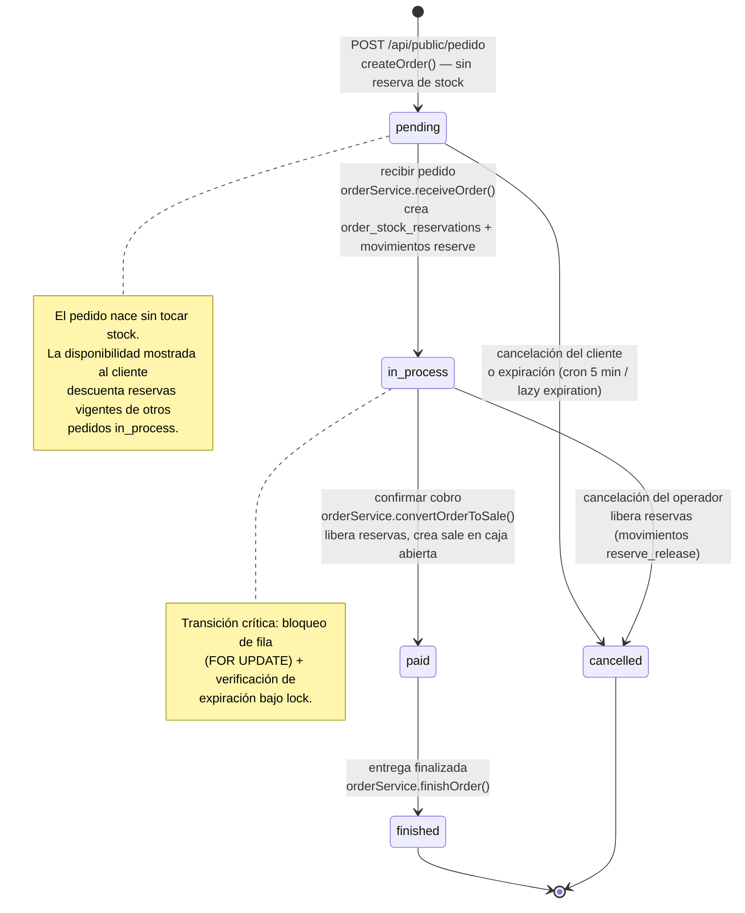

# Flujo de pedidos — ciclo de vida completo

**Estado:** implementado
**Fuente verificada en:** `src/application/services/orderService.ts`, rutas `src/app/api/(public/)pedido*/`, `src/db/schema.ts`

## Diagrama de estados

> Render: [diagramas/svg/flujo-pedidos.svg](diagramas/svg/flujo-pedidos.svg)

## Estados (`order_status`)

| Estado | Significado | Quién lo produce |
| --- | --- | --- |
| `pending` | Creado por el cliente, aún no visto por el local | `POST /api/public/pedido` → `orderService.createOrder` |
| `in_process` | Recibido por el operador; stock reservado | `POST /api/pedidos/[id]/recibir` → `receiveOrder` |
| `paid` | Cobrado: ya existe una `sale` vinculada (`orders.converted_sale_id`) | `POST /api/pedidos/[id]/confirmar` → `convertOrderToSale` |
| `finished` | Entregado/cerrado | `POST /api/pedidos/[id]/finalizar` → `finishOrder` |
| `cancelled` | Cancelado por cliente/operador o expirado | `cancelOrder`, `expirePendingOrders`, lazy expiration |

## Invariantes de stock — lo importante

- **`pending` NO reserva stock.** El pedido nace solo con `orders` + `order_items` + `order_item_recipes` (snapshots de receta elegidos).
- **La disponibilidad pública** (`catalogService.listPublicCatalogWithAvailability`, `validatePublicCart`, `POST /api/public/disponibilidad`) se calcula como `stock − reservas vigentes de pedidos in_process` (`lib/product-helpers.ts`: `applyReservationsToStock`, `calculateAvailability*`).
- **Al recibir** (`receiveOrder`): bajo `FOR UPDATE`, si no hay reservas existentes inserta `order_stock_reservations` y movimientos `reserve`. Las reservas son la frontera entre "pedido anunciado" y "stock comprometido".
- **Al confirmar cobro** (`convertOrderToSale`): libera reservas (`reserve_release` implícito en la lógica) y descuenta stock real con movimientos `sale`, crea `sales` + `sale_items` + `sale_payments` + `sale_item_recipes` y actualiza los totales/resúmenes de la `cash_registers` abierta — todo en una transacción.
- **Al cancelar desde `in_process`:** libera reservas con movimientos `reserve_release`. Desde `pending` no hay nada que liberar (salvo reservas legacy, que el código cubre).

## Expiración (tres caminos, mismo efecto)

| Trigger | Dónde | Detalle |
| --- | --- | --- |
| **Cron activo** | `GET /api/cron/expire-orders` cada 5 min vía **GitHub Actions** (`.github/workflows/expire-orders.yml`), `Bearer CRON_SECRET`, `maxDuration=300` | `expirePendingOrders` procesa por lotes: `FOR UPDATE` y solo cancela si sigue `pending` |
| **Lazy expiration** | `trackOrder`, `receiveOrder`, `convertOrderToSale` | Si el pedido `pending` ya pasó `createdAt + ORDER_EXPIRATION_MS`, se cancela bajo lock antes de continuar |
| `cancelOrder` | Cliente (`/api/public/pedido/[id]/cancelar` con `cancellationToken`) u operador (`/api/pedidos/[id]/cancelar`) | Transición explícita a `cancelled` |

## Idempotencia

- **Creación:** `POST /api/public/pedido` acepta `idempotencyKey`; UNIQUE `(branch_id, idempotency_key)` + hash sha256 del payload. Clave repetida con mismo payload → devuelve el pedido original (`deduplicated: true` en la respuesta); con payload distinto → 409.
- **Conversión a venta:** mismo mecanismo sobre `sales` (reintento seguro del doble click del operador).
- El cliente genera la clave con `useSubmitIdempotencyKey` (hook).

## Seguridad del canal público

- `cancellation_token` (UNIQUE) es la credencial del pedido: seguimiento, chat y cancelación exigen `id + token` (`findByIdWithToken`).
- Rate limit por IP en creación de pedido (`scope=order`, tabla `public_order_rate_limits`), chat y polling.
- Respuesta pública saneada: `InsufficientStockError` se traduce a `INSUFFICIENT_STOCK` + nombre de producto sin exponer insumos ni cantidades.

## Endpoints del ciclo

| Acción | Endpoint | Servicio |
| --- | --- | --- |
| Crear | `POST /api/public/pedido` | `createOrder` |
| Seguimiento | `POST /api/public/pedido/seguimiento` | `trackOrder` |
| Estado público | `GET /api/public/pedido/[id]/estado` | `chatService.getOrderChatStatus` |
| Cancelar (cliente) | `POST /api/public/pedido/[id]/cancelar` | `cancelOrder` |
| Listar (panel) | `GET /api/pedidos?status=…` | `getOrders` / `getPendingOrders` / `getOrderCountsByStatus` |
| Recibir | `POST /api/pedidos/[id]/recibir` | `receiveOrder` |
| Confirmar → venta | `POST /api/pedidos/[id]/confirmar` | `convertOrderToSale` |
| Cancelar (operador) | `POST /api/pedidos/[id]/cancelar` | `cancelOrder` |
| Finalizar | `POST /api/pedidos/[id]/finalizar` | `finishOrder` |
| Chat | `GET/POST …/chat`, `…/chat/leido`, `…/chat/upload`, `…/chat/ubicacion`, `…/chat/stream` | `chatService` |

Para reglas de negocio (qué significa cada estado para el local) ver [guia-funcionamiento-pancheria.md](../guia-funcionamiento-pancheria.md).
