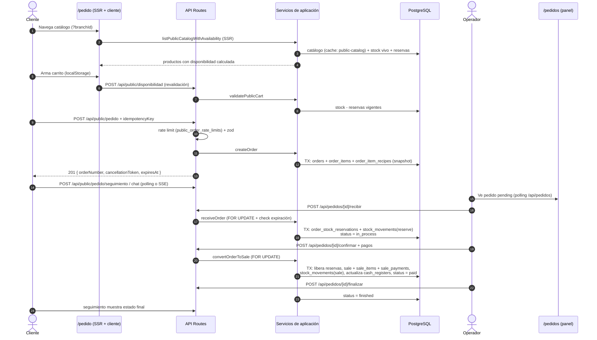
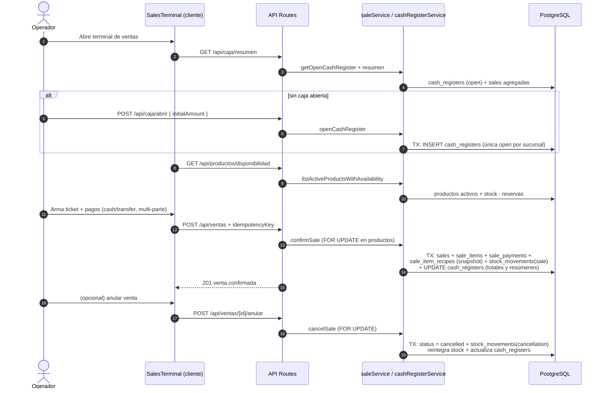
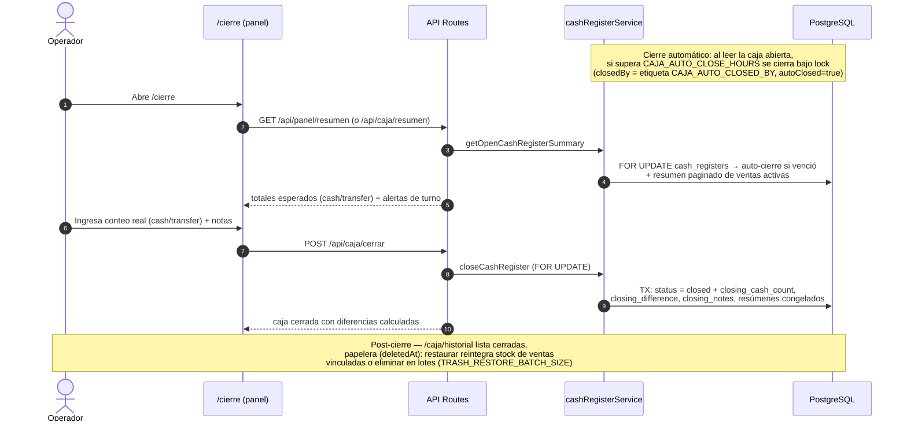
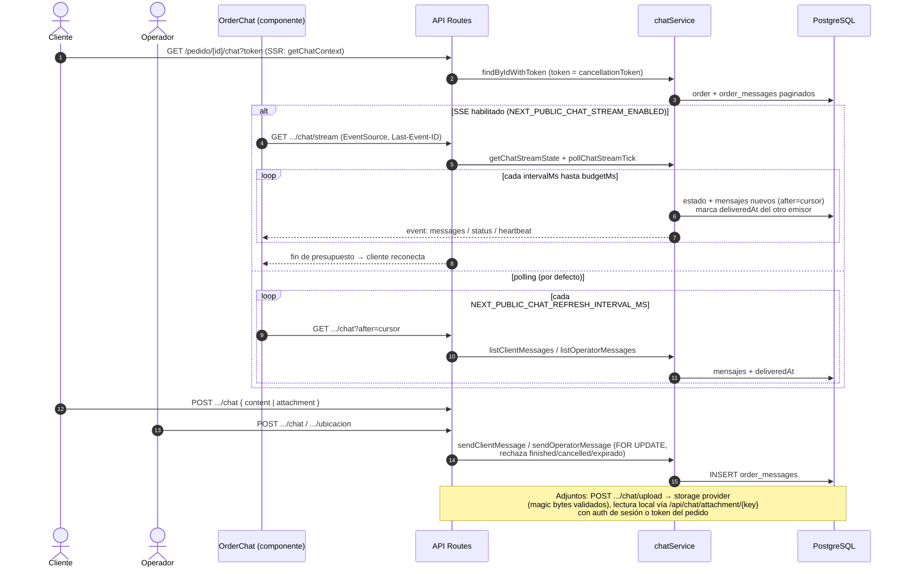
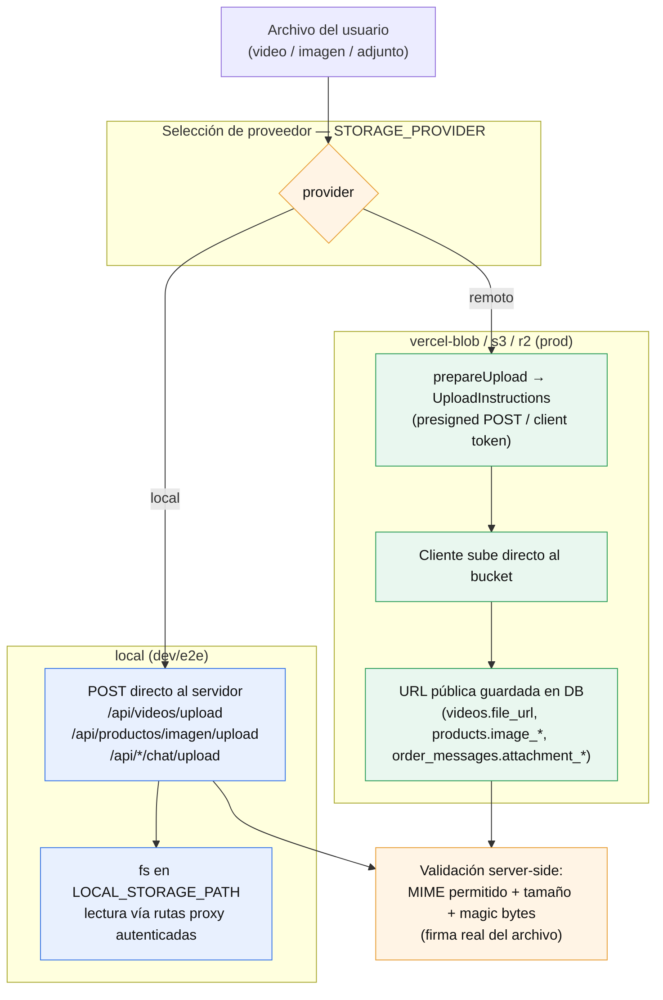

# Flujos de datos — punta a punta

**Estado:** implementado
**Cinco flujos críticos verificados en código.** Cada diagrama tiene su fuente `.mmd` en [`diagramas/`](diagramas/).

## Índice

1. [Pedido público → venta confirmada](#1-pedido-público--venta-confirmada) — `flujos-de-datos.mmd`
2. [Venta directa en el panel](#2-venta-directa-en-el-panel-ventas) — `flujo-venta-directa.mmd`
3. [Cierre de caja](#3-cierre-de-caja) — `flujo-cierre-caja.mmd`
4. [Chat del pedido](#4-chat-del-pedido-polling--sse-opt-in) — `flujo-chat.mmd`
5. [Subida de archivos](#5-subida-de-archivos-storage) — `flujo-uploads.mmd`

## 1. Pedido público → venta confirmada

> Fuente: [diagramas/flujos-de-datos.mmd](diagramas/flujos-de-datos.mmd)

Puntos clave: el catálogo base viene del Data Cache (`public-catalog`) pero la disponibilidad se calcula en vivo; el pedido nace sin reservar stock; todas las transiciones críticas van bajo `FOR UPDATE` dentro de `executeInTransaction`.

## 2. Venta directa en el panel (`/ventas`)

> Fuente: [diagramas/flujo-venta-directa.mmd](diagramas/flujo-venta-directa.mmd)

Puntos clave: la venta exige una caja `open` (única por sucursal, garantizada por índice parcial); el stock se descuenta por receta seleccionada con snapshots en `sale_item_recipes`; anular reintegra stock con movimientos `cancellation`.

## 3. Cierre de caja

> Fuente: [diagramas/flujo-cierre-caja.mmd](diagramas/flujo-cierre-caja.mmd)

Puntos clave: el cierre congela `products_summary`, `critical_supplies_summary` y `recipe_supplies_summary` (JSONB); las diferencias se calculan contra el conteo declarado; el auto-cierre usa la etiqueta `CAJA_AUTO_CLOSED_BY` (por eso `closed_by` no es FK).

## 4. Chat del pedido (polling + SSE opt-in)

> Fuente: [diagramas/flujo-chat.mmd](diagramas/flujo-chat.mmd)

Puntos clave: el SSE (`chat-stream.ts`) hace polling interno a la DB con heartbeat y presupuesto de conexión (`CHAT_STREAM_*`); al expirar el budget el `EventSource` reconecta solo. El polling REST es el fallback por defecto. Solo se permite ubicación de sucursal en pedidos `pickup`.

## 5. Subida de archivos (storage)

> Fuente: [diagramas/flujo-uploads.mmd](diagramas/flujo-uploads.mmd)

Puntos clave: el provider se elige por `STORAGE_PROVIDER` en runtime (`config/videos.ts`), con warning si es `local` en producción (fs efímero en Vercel) y validación de build en `next.config.ts`. La validación de contenido usa firma real (magic bytes), no el MIME declarado. Las lecturas locales pasan por proxies autenticados (`/api/videos/[id]/stream` con Range, `/api/chat/attachment/[key]`, `/api/productos/imagen/[key]`).

## Caché y frescura (transversal)

| Dato | Estrategia |
| --- | --- |
| `branches` (lookup por id/nombre) | `unstable_cache` tag `branches` — invalida `revalidateTag('branches', {expire:0})` al mutar sucursales |
| Catálogo público base | tag `public-catalog` — invalida al mutar productos/recetas |
| Stock, reservas, caja, mensajes | **siempre en vivo** (decisión deliberada) |
| Estado de sucursal público | headers CDN `s-maxage`/`swr` (`/api/public/sucursal/estado`) |

Volver al índice: [README.md](README.md)
