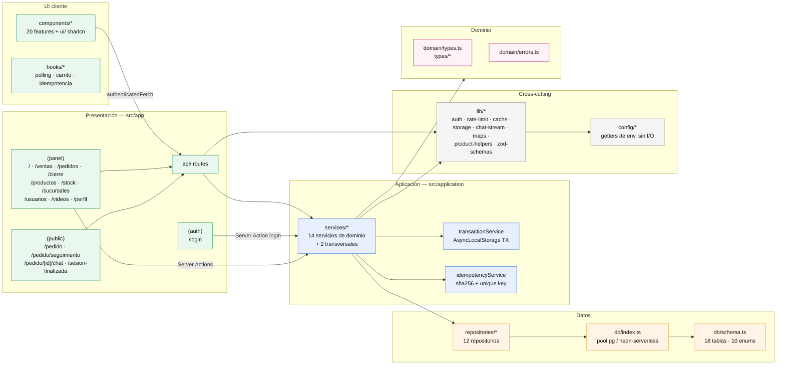

# Módulos y capas — Nivel 2

**Estado:** implementado
**Fuente verificada en:** estructura de `src/`, imports reales de cada archivo

## Forma general

Monolito modular con capas por convención (no hay enforcement por tooling):

```
app/  (páginas, Server Actions, API routes)
  └─► application/services/  (casos de uso, transacciones, reglas)
        └─► repositories/  (queries Drizzle)
              └─► db/schema.ts + db/index.ts
  └─► domain/ + types/  (tipos y errores de dominio, sin dependencias)
  └─► lib/ + config/  (cross-cutting: auth, cache, rate limit, storage, validación)
  └─► components/ + hooks/  (UI por feature, client components)
```

Regla observada en código: las **API routes y Server Actions nunca tocan `db` directamente** — delegan en `application/services/*`. Los repositorios son el único lugar con queries Drizzle sobre las tablas de negocio (excepciones deliberadas: `idempotencyService` y los rate-limit stores consultan sus tablas propias).

## Mapa de módulos (nivel 2)



> Fuente regenerable: [diagramas/modulos.mmd](diagramas/modulos.mmd). El diagrama navegable de nivel 1 está en [overview.md](overview.md) / [diagramas/overview.mmd](diagramas/overview.mmd).

## 1. Presentación — `src/app`

### Route groups

| Grupo | Rutas | Características |
| --- | --- | --- |
| `(public)` | `/pedido`, `/pedido/seguimiento`, `/pedido/[id]/chat` | Sin login. `force-dynamic` en las tres páginas (CSP nonce + no consultar DB en build). `PedidoClient` orquesta catálogo + carrito en `localStorage` (`pancheria-branch-id`, carrito por `cart-helpers`). |
| `(panel)` | `/` dashboard, `/ventas` (+`historial`, `historial/[id]`, `historial/eliminadas`), `/pedidos` (+`[id]`), `/cierre`, `/productos` (+`nuevo`, `[id]/editar`, `eliminados`), `/stock`, `/sucursales` (+`nueva`, `[id]/editar`), `/usuarios` (+`nuevo`, `[id]/editar`), `/videos` (+`nuevo`, `[id]`, `eliminados`), `/perfil` | Requiere sesión: el layout llama `getCurrentBranchIdOrRedirect` y envuelve todo en `TourProvider` (driver.js). Admin ve selector de sucursal (`branch-selector` → Server Action `setActiveBranchAction` → cookie `activeBranchId`). |
| `(auth)` | `/login` | Server Action `login` → `signIn` de NextAuth. |
| raíz | `/sesion-finalizada`, `not-found`, `layout.tsx` | `/sesion-finalizada`: cierre de sesión forzado cuando la sucursal/usuario del JWT fue eliminado. Layout raíz inyecta `ConditionalAnalytics`. |

### Server Actions (mutaciones del panel)

| Archivo | Acciones |
| --- | --- |
| `(panel)/actions.ts` | `setActiveBranchAction` (selector admin) |
| `(panel)/productos/actions.ts` | borrar / restaurar / eliminar permanentemente productos |
| `(panel)/sucursales/actions.ts` | CRUD sucursales + resumen de eliminación (`requireAdmin`) |
| `(panel)/usuarios/actions.ts` | CRUD usuarios (`requireAdmin`) |
| `(panel)/videos/actions.ts` | prepareUpload / CRUD / papelera de videos |
| `(panel)/perfil/actions.ts` | `changePassword` |
| `(auth)/login/actions.ts` | `login` |

### API Routes (todas `runtime = 'nodejs'`)

Patrón estándar: `withApiErrorHandling(withAuth(handler))` para rutas del panel; `withApiErrorHandling` + rate limit por IP + Zod para `/api/public/*`; `withCronAuth` para `/api/cron/*`.

| Grupo | Rutas | Servicio principal |
| --- | --- | --- |
| `api/caja` | `abrir`, `cerrar`, `resumen`, `historial` (GET/DELETE), `eliminadas` (GET/DELETE), `[id]` (GET/DELETE), `[id]/restaurar`, `[id]/permanente` | `cashRegisterService` |
| `api/pedidos` | `GET /` (lista paginada), `[id]` (GET), `[id]/recibir`, `[id]/confirmar`, `[id]/cancelar`, `[id]/finalizar`, `[id]/chat` (GET/POST), `[id]/chat/leido`, `[id]/chat/ubicacion`, `[id]/chat/upload`, `[id]/chat/stream` (SSE) | `orderService`, `chatService`, `branchService` |
| `api/ventas` | `GET /`, `POST /` (confirmar venta), `[id]/anular`, `disponibilidad` | `saleService` |
| `api/productos` | `GET/POST /`, `[id]` (GET/PUT/DELETE), `disponibilidad`, `eliminadas` (GET/DELETE), `imagen/preparar`, `imagen/upload`, `imagen/[key]` (GET **pública**, scoped por `?branchId`, solo imágenes de productos vendibles — provider local) | `productService`, `saleService` (disponibilidad), storage |
| `api/stock` | `GET /` (alertas), `ajustar`, `movimientos` | `stockService` |
| `api/recetas` | `GET /` (insumos para recetas) | `recipeService` |
| `api/videos` | `upload` (POST, solo local), `[id]/stream` (GET admin: stream local con Range o redirect a URL pública remota) | `videoService`, `storage` |
| `api/public` | `catalogo`, `disponibilidad`, `pedido` (POST crear), `pedido/seguimiento` (POST), `pedido/[id]/cancelar`, `pedido/[id]/estado`, `pedido/[id]/chat` (GET/POST) + `leido` + `stream` + `upload`, `sucursal/estado` | `catalogService`, `orderService`, `chatService`, `branchService`, `cashRegisterService` |
| `api/panel` | `resumen` (GET: resumen de sucursal para dashboard) | `cashRegisterService` + `orderService` + `stockService` |
| `api/cron` | `expire-orders`, `rate-limit-cleanup`, `chat-attachments-cleanup` (todos GET + Bearer) | `orderService`, `cleanupService`, rate-limit stores |
| `api/chat` | `attachment/[key]` (GET: solo provider `local`; sesión o `?token`) | `chat-storage` |
| `api/auth` | `[...nextauth]` | NextAuth handlers |
| `api/health` | `GET` (`SELECT 1`) | `db` directo (sin servicio) |

## 2. Aplicación — `src/application`

14 servicios de dominio en `services/` + 2 servicios transversales en la raíz de `application/` (`transactionService`, `idempotencyService`).

| Servicio | Responsabilidad (verificada) |
| --- | --- |
| `authService` | `verifyCredentials` (bcrypt + bloqueo por usuario vía `login_attempts`) |
| `branchService` | CRUD sucursales, resumen de impacto de borrado, `deleteBranch` (hard delete: borra hijos en TX y archivos externos post-commit best-effort) |
| `cashRegisterService` | Abrir/cerrar caja, **cierre automático bajo lock** (`CAJA_AUTO_CLOSE_HOURS`), resúmenes paginados, papelera de cajas (restaurar reintegra stock; vaciado en lotes `TRASH_RESTORE_BATCH_SIZE`), estado de turno y alertas |
| `catalogService` | Catálogo público, disponibilidad y `validatePublicCart` |
| `chatService` | Mensajes cliente/operador, ubicación de sucursal, estado SSE (`getChatStreamState`/`pollChatStreamTick`), marcas `deliveredAt`/`readAt`, bloqueo en estados terminales/expirados |
| `cleanupService` | Limpiezas del cron: adjuntos/imágenes/videos huérfanos, retención de mensajes |
| `orderService` | Ciclo de vida del pedido: `createOrder` (con idempotencia), `receiveOrder` (reservas), `convertOrderToSale`, `cancelOrder`, `finishOrder`, `expirePendingOrders`, `trackOrder` (lazy expiration) |
| `productService` | CRUD productos, papelera (soft delete / restore / delete permanente / vaciado), imágenes |
| `recipeService` | CRUD recetas e insumos |
| `saleService` | `confirmSale`, `cancelSale`, `insertSaleAndUpdateCashRegister`, listados por caja/rango, resúmenes de caja |
| `stockService` | Alertas de stock, ajuste manual, historial de movimientos |
| `summaryService` | Cálculo de resúmenes de ventas para la caja (`calculateSummaryFromSales`, versión paginada); re-exporta `calculateCompoundAvailability` |
| `userService` | CRUD usuarios, cambio de contraseña |
| `videoService` | Videos: `prepareUpload` (instrucciones de subida del provider), CRUD, papelera |
| `transactionService` | `executeInTransaction` con `AsyncLocalStorage` (propaga la TX a llamadas anidadas) |
| `idempotencyService` | Hash sha256 canónico del payload + verificación contra `idempotency_key`/`idempotency_hash` (sales y orders, unique por sucursal) |

## 3. Datos — `src/repositories`, `src/db`

- **12 repositorios** alineados a agregados: `branch`, `cashRegister`, `catalog`, `order`, `orderMessage`, `orderStockReservation`, `product`, `recipe`, `sale`, `stockMovement`, `user`, `video`.
- **`src/db/index.ts`**: proxy lazy que elige driver según la URL — `@neondatabase/serverless` si contiene `neon.tech`, si no `pg.Pool` — con pool configurable (`DATABASE_POOL_MAX`, `DATABASE_CONNECTION_TIMEOUT_MS`, `DATABASE_IDLE_TIMEOUT_MS`).
- **`src/db/schema.ts`**: 18 tablas, 10 enums, índices y checks — detalle completo en [base-de-datos.md](base-de-datos.md).
- Patrones de concurrencia usados: `SELECT … FOR UPDATE` vía repositorios (`findByIdForUpdate`, `findByIdWithTokenForUpdate`), unique parcial `cash_registers` (una caja `open` por sucursal), upserts atómicos en tablas de rate limit.

## 4. Dominio — `src/domain`, `src/types`

- `domain/types.ts`: tipos compartidos (Order, Sale, Product, Branch incl. `phones`/`socialLinks`/`openingHours` como shapes jsonb).
- `domain/errors.ts`: jerarquía `DomainError` → `NotFoundError`, `ValidationError`, `ForbiddenError` (+ `BranchRemovedError`, `UserRemovedError` con `code`), `ConflictError`, `InsufficientStockError`, `UnauthorizedError`, `LoginAttemptsExceededError`, `DatabaseConnectionError`.
- `types/next-auth.d.ts`: extensión del `Session`/`JWT` (`id`, `role`, `branchId`, `branchName`).

## 5. Cross-cutting — `src/lib`, `src/config`

| Área | Archivos clave |
| --- | --- |
| Auth/sesión | `auth.ts` (`requireAuth`, `requireAdmin`, `getCurrentBranchId*`, `revalidateSessionUser` con WeakSet dedupe), `with-auth.ts`, `route-guard.ts`, `proxy.ts` (CSP nonce), `csp-helpers.ts` |
| Errores API | `api-handler.ts` (mapeo DomainError→HTTP + logs), `cron-handler.ts` (Bearer timing-safe) |
| Rate limit | `rate-limit.ts` (IP confiable: `x-vercel-forwarded-for` / `TRUSTED_PROXY_IP_HEADER` / opt-in private IPs; fail-closed en producción), `rate-limit-store.ts` (`login_attempts`), `public-order-rate-limit-store.ts` (tabla `public_order_rate_limits` o memoria), `chat-poll-rate-limit.ts` (in-memory para polling) |
| Cache servidor | `server-cache.ts` (`unstable_cache` con tags `branches`, `public-catalog`; invalidación `revalidateTag(…, {expire:0})`; bypass con `DATA_CACHE_REVALIDATE_S<=0`) |
| Storage | `storage.ts` (providers local/vercel-blob/s3/r2 + validación de magic bytes), `chat-storage.ts`, `product-image-storage.ts`, `orphaned-files.ts`, `public-url.ts` |
| Chat tiempo real | `chat-stream.ts` (SSE: heartbeat, budget, `Last-Event-ID`, poll interno a DB) |
| Negocio puro | `cart-pipeline.ts`, `product-helpers.ts` (disponibilidad = stock − reservas), `branch-helpers.ts` (horarios/turnos), `cash-register-helpers.ts`, `stock-helpers.ts`, `payment-helpers.ts`, `sale-helpers.ts`, `order-helpers.ts`, `summary-helpers.ts`, `maps.ts` (URLs/embeds de mapa) |
| Cliente | `fetch.ts` (`authenticatedFetch`, timeout, `ApiError`), `selected-branch.ts`, `recent-orders.ts`, `cart-helpers.ts`, `last-customer-*` |
| Varios | `zod-schemas.ts`, `pagination.ts`, `id.ts`, `date.ts` (UTC helpers), `money.ts`, `db-errors.ts`, `logger.ts` (logs estructurados JSON), `cache-control.ts`, `fetch-all-pages.ts`, `validation-helpers.ts`, `utils.ts` |
| Config | `config/*`: getters puros de env por dominio (`database`, `env`, `auth`, `branch`, `orders`, `chat`, `rate-limit`, `storage`, `videos`, `catalog`, `pagination`, `routes`, `cron`, `analytics`, `product-images`, `caja`, …). `config/api.ts` centraliza las rutas `/api/*` que consumen los componentes cliente. Regla del proyecto: `config` no accede a DB ni tiene side effects. |

## 6. UI — `src/components`, `src/hooks`

Componentes agrupados por feature (coexisten `pedido/` = catálogo público y `pedidos/` = gestión en panel): `caja/`, `cart/`, `chat/`, `pagos/`, `panel/`, `pedido/`, `pedidos/`, `productos/`, `promo/`, `stock/`, `sucursales/`, `tour/` (driver.js), `usuarios/`, `ventas/`, `videos/` + `ui/` (shadcn/ui sobre `@base-ui/react`).

Hooks con lógica compartida: `usePaginatedData`, `useVisibilityPolling`, `useCart`, `useSellableCart`, `useCashRegister`, `useDashboard`, `useCast` (Google Cast sender), `useSubmitIdempotencyKey`, `useConfirmDialog`, `useErrorDialog`, `usePaymentParts`, `useRecentOrders`, `useClockInterval`.

## Dependencias de nivel (resumen verificado)

- `app` → `application/services` + `lib` + `config` + `domain`
- `application/services` → `repositories` + `application` (transaction/idempotency) + `lib` + `config` + `domain` + `db/schema` (tipos `$inferInsert`)
- `repositories` → `db` (drizzle) + `domain/types` + `lib` helpers puros
- `components`/`hooks` → `lib` + `config` + `domain/types`; **nunca** tocan `repositories` ni `db` (las llamadas van por `/api/*`)
- `config` → `process.env` solamente
- `domain` → sin dependencias internas

Siguiente nivel: [base-de-datos.md](base-de-datos.md) — modelo ER completo.
