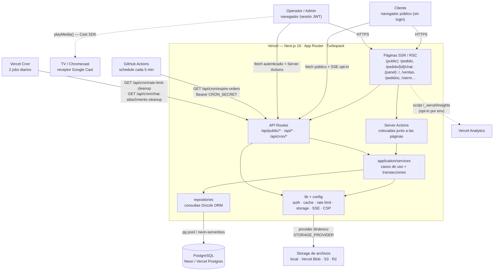

# Overview — Nivel 1: el sistema completo

**Estado:** implementado
**Fuente verificada en:** `src/`, `vercel.json`, `.github/workflows/`, `next.config.ts`, `package.json`

## En una frase

Panchería es una **aplicación monolítica Next.js 16** desplegada en Vercel que combina un **catálogo público de pedidos online** y un **panel de gestión** (ventas, caja, stock, productos, sucursales, usuarios, videos, chat de pedidos) sobre una única base **PostgreSQL**.

## Diagrama de nivel 1

> Render: [diagramas/svg/overview.svg](diagramas/svg/overview.svg)

## Actores

| Actor | Acceso | Autenticación |
| --- | --- | --- |
| Cliente público | Catálogo `/pedido`, seguimiento `/pedido/seguimiento`, chat `/pedido/[id]/chat` | Ninguna; el `cancellationToken` del pedido actúa como credencial de acceso al pedido |
| Operador | Panel completo acotado a su sucursal | NextAuth credentials → JWT (`role=operator`) |
| Admin | Panel completo + gestión de sucursales/usuarios + selector de sucursal activa | JWT (`role=admin`) + cookie `activeBranchId` |
| Procesos externos | GitHub Actions y Vercel Cron llaman `/api/cron/*` | `Authorization: Bearer CRON_SECRET` (comparación timing-safe) |

## Topología de ejecución

- **Runtime:** todas las rutas API verificadas usan `runtime = 'nodejs'` (sin Edge).
- **Render:** Server Components con `dynamic = 'force-dynamic'` en las páginas que leen DB (`/pedido`, `/pedido/seguimiento`, `/pedido/[id]/chat`) — nada se pre-renderiza contra la base en build.
- **Middleware/proxy:** `src/proxy.ts` (NextAuth `auth()` + CSP con nonce por request). La autorización por ruta la resuelve `authConfig.callbacks.authorized` → `src/lib/route-guard.ts`.
- **Autorización en API:** `withAuth` (`src/lib/with-auth.ts`) envuelve handlers del panel y resuelve `{ session, branchId }`; `withApiErrorHandling` (`src/lib/api-handler.ts`) mapea errores de dominio a HTTP (401/403/400/404/409/503/500) con logging estructurado.
- **Clientes:** los componentes cliente llaman a `/api/*` con `authenticatedFetch` (`src/lib/fetch.ts`, timeout + errores tipados) y hacen polling con `useVisibilityPolling` / `usePaginatedData`.

## Superficie pública vs. autenticada

| Prefijo | Auth | Propósito |
| --- | --- | --- |
| `/api/public/*` | Ninguna + rate limit por IP | Catálogo, disponibilidad, crear pedido, seguimiento, chat del cliente, estado de sucursal |
| `/api/pedidos`, `/api/ventas`, `/api/caja`, `/api/productos`, `/api/stock`, `/api/recetas`, `/api/videos`, `/api/panel/*` | Sesión JWT (+ `admin` en algunas) | Operaciones del panel |
| `/api/chat/attachment/[key]` | Sesión **o** `?token` del pedido (solo provider `local`) | Descarga de adjuntos de chat |
| `/api/cron/*` | Bearer `CRON_SECRET` | Limpiezas programadas + expiración de pedidos |
| `/api/auth/[...nextauth]` | — | NextAuth handler |
| `/api/health` | Ninguna | `SELECT 1` para monitores de uptime |

## Límites del sistema

- **Sin gateway ni cola de trabajos:** toda la lógica corre in-process en las funciones serverless.
- **Sin WebSocket/pubsub:** el chat usa polling REST por defecto y **SSE opt-in** (`NEXT_PUBLIC_CHAT_STREAM_ENABLED`) con presupuesto de conexión acotado (`maxDuration = 60`).
- **Sin pagos online:** solo efectivo/transferencia registrados manualmente. Sin integración de pasarela (verificada la ausencia de Mercado Pago).
- **Sin subdominios ni aislamiento por tenant:** multi-sucursal por `branchId` lógico; el multi-tenant compartido (T14) está propuesto y diferido, **no implementado**.

Siguiente nivel: [modulos.md](modulos.md) — descomposición en capas y módulos.
