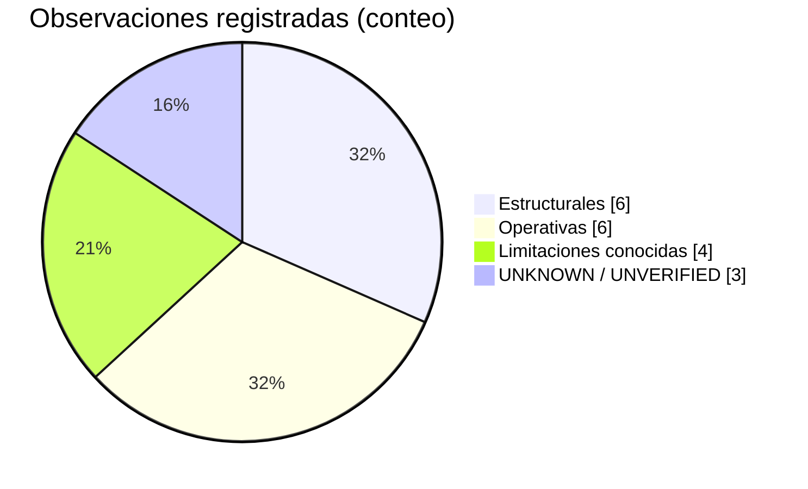

# Salud de la arquitectura — observaciones

**Estado:** implementado
**Alcance:** solo observaciones verificadas en código y documentación. No hay propuestas de cambio en este documento.

> Render: [diagramas/svg/salud-arquitectura.svg](diagramas/svg/salud-arquitectura.svg)

## Fortalezas verificadas

- **Separación de capas consistente:** ninguna API route ni Server Action toca `db` directamente (salvo excepciones deliberadas listadas abajo). Los handlers son finos: auth → validación Zod → servicio → `NextResponse`.
- **Concurrencia tratada en serio:** `FOR UPDATE` en transiciones críticas (recibir/confirmar/cancelar pedido, abrir/cerrar caja, ajuste de stock), unique parcial para "una caja abierta por sucursal", upserts atómicos en rate limits, unicidad `(branch_id, idempotency_key)` en `orders`/`sales`.
- **Idempotencia real** en las dos mutaciones más sensibles (crear pedido, confirmar venta) con hash sha256 del payload canónico — distinguen "reintento idéntico" de "mismo key con otro payload".
- **Fail-closed en producción:** sin IP confiable para rate limit → `RateLimitConfigError` → 500 (no bypass silencioso); `STORAGE_PROVIDER=local` rechazado en build de producción; secreto de auth < 32 bytes → error al iniciar.
- **Borrado de sucursal coherente:** hard delete con resumen de impacto previo, cascada manual en TX, y cleanup de archivos externos + rate limits post-commit con warnings estructurados y reintento vía cron.
- **Defensa en profundidad en el frente público:** token de pedido como credencial, rate limits por scope, respuesta saneada de stock insuficiente, CSP con nonce, headers de seguridad en `next.config.ts`.
- **Cache deliberadamente acotado:** solo `branches` y catálogo base (Data Cache con tags); stock/reservas/caja/chat siempre en vivo.

## Observaciones (sin fixes)

### Estructurales

1. **Dos canales de mutación coexisten:** Server Actions (operaciones de formulario del panel: sucursales, usuarios, videos, productos papelera, perfil, login) y API Routes (todo lo operativo en vivo: ventas, pedidos, caja, chat). El criterio observado es consistente — actions para formularios admin, API para flujos con polling — pero es una decisión a mantener documentada, no evidente para un lector nuevo.
2. **Excepciones deliberadas a la regla "solo repositorios tocan DB":**
   - `idempotencyService` consulta `sales`/`orders` directamente (servicio de infraestructura transversal).
   - `rate-limit-store.ts` y `public-order-rate-limit-store.ts` consultan `login_attempts`/`public_order_rate_limits` (tablas de infraestructura, no agregados de negocio).
   - `GET /api/health` ejecuta `SELECT 1` directo.
3. **`cash_registers.closed_by` es `varchar`, no FK a `users`** — deliberado: el auto-cierre escribe la etiqueta `CAJA_AUTO_CLOSED_BY` (default `Sistema`).
4. **Ciclos de vida de borrado heterogéneos:** soft delete en `products`, `cash_registers`, `orders`, `videos`; hard delete en `branches`/`users`; "anulación" (no borrado) en `sales`. Cada variante está implementada y es intencional, pero conviene mantenerla visible para no asumir uniformidad.
5. **`next-auth` está en beta (`5.0.0-beta.32`)** con nota de migración documentada en `src/auth.config.ts`. El JWT no se revalida contra DB por request por defecto — el proyecto lo compensa con `revalidateSessionUser` (una query por objeto sesión, dedupe por `WeakSet`).
6. **Drivers de DB duales:** `pg.Pool` vs `@neondatabase/serverless` elegidos por substring `neon.tech` en la URL — funciona, pero acopla la elección de driver al hostname.

### Operativas

7. **Crons divididos entre dos schedulers:** Vercel Cron (limpiezas diarias) + GitHub Actions (expire-orders cada 5 min). La división responde al límite del plan Hobby (crons diarios en Vercel); implica que la expiración de pedidos depende de la disponibilidad del scheduler de GitHub, no del runtime de la app.
8. **SSE opt-in y con presupuesto:** `NEXT_PUBLIC_CHAT_STREAM_ENABLED` apaga/enciende el stream; `CHAT_STREAM_BUDGET_MS` cierra la conexión y delega la reconexión al `EventSource`. Impacto de costo en Vercel con SSE activo: `UNKNOWN / UNVERIFIED` (sin métricas de prod documentadas).
9. **El polling del chat escribe en DB en cada tick** (`deliveredAt`), salvo el stream que solo escribe cuando llegan mensajes del otro emisor — diferencia de carga intencional y documentada en código.
10. **`GET /api/public/sucursal/estado` usa `s-maxage`/`swr` de CDN** (`PUBLIC_BRANCH_STATUS_CACHE_*`): el estado "abierto/cerrado" puede quedar hasta `s-maxage` viejo en edge.
11. **`expire-orders` declara `*/5` pero corre ~4–8 veces por día** (verificado 2026-10-01: 30 corridas `success` en ~7 días con gaps de 2.5–8 h — las schedules cortas de GitHub Actions se throttlean en la práctica). Sin impacto hoy: la expiración lazy en `trackOrder`/listado cubre la lectura y `orders` tiene 0 filas en prod. Si el flujo público se activa, la frecuencia real es la observada, no la declarada.
12. **Storage de producción verificado OK, pero nunca usado:** `STORAGE_PROVIDER=vercel-blob` (valor descifrado de la env de prod, con CRLF final que el código absorbe con `.trim()`), `BLOB_READ_WRITE_TOKEN` y `BLOB_STORE_ID` presentes en `production` desde hace ~48 días; el store `pancheria-videos` (`store_xXpKdw0YlnCYqBjz`, `iad1`, `public`) está `Active` pero **tamaño 0 B** — nunca se subió un archivo real a producción. Las 2 filas de `videos` apuntan a `http://localhost:3000/...` y son residuo de **tests E2E corridos contra la base productiva** el 2026-08-24 ("Video de prueba E2E", "Video de streaming E2E"): referencias rotas que convendría borrar desde el panel (soft delete).

### Limitaciones conocidas (de informes, confirmadas en código)

13. **`/_not-found` se genera estática** y no fuerza nonce dinámico — limitación conocida de la CSP (ver `auditoria-qa-ronda-2-2026-09-23`).
14. **E2E sin Neon efímero por run:** sharding opt-in implementado (`E2E_SHARDS`), pero cada shard reutiliza una base fija descartable; `global-setup` trunca tablas. Provisión efímera por run: no implementada.
15. **Cleanup de storage externo post-commit:** si el provider falla, los archivos quedan huérfanos hasta que el cron `chat-attachments-cleanup` los recoja — ventana de fuga deliberada y mitigada con cron.
16. **E2E destructivo por diseño:** `global-setup` trunca todas las tablas de negocio; requiere guardas de nombre de base (`test|e2e|testing|qa|staging`) — `E2E_ALLOW_REMOTE_DB=true` puentea la guarda de host (escape documentado).

## Discrepancias documentación ↔ código

| Documento | Dice | Código real |
| --- | --- | --- |
| `guia-funcionamiento-pancheria.md` | Decía que el enum conservaba valores legacy `order`/`order_cancellation` — **corregido 2026-10-01** | `stock_movement_type` tiene solo `sale`, `cancellation`, `manual_adjustment`, `restock`, `reserve`, `reserve_release` (la migración `0009` recreó el enum; los valores legacy ya no existen en runtime) |
| Planes/prompts históricos | Mencionan Mercado Pago como integración | **Cero referencias** en `src/` ni `.env.example` — es propuesta futura, no integración |
| `README.md` raíz / docs | Implican comportamiento uniforme de borrado | `branches` = hard delete deliberado (no soft delete); ver reglas en [base-de-datos.md](base-de-datos.md) |
| Prompt de arquitectura | Describe crons "en vercel.json" | Solo 2 de 3 crons viven en `vercel.json`; `expire-orders` corre desde **GitHub Actions** (`.github/workflows/expire-orders.yml`) |

## `UNKNOWN / UNVERIFIED` (actualizado 2026-10-01 tras verificación operativa)

Verificado desde el último informe:

- **Proveedor de DB productiva:** Neon gestionado por Vercel (org `managed_by: vercel`, proyecto `pancheria`, branch `main`, base `neondb`, PG 17, `us-east-1`). La URL contiene `neon.tech` → el runtime usa `@neondatabase/serverless`. `/api/health` responde `db: "up"`; 34 migraciones aplicadas.
- **Cadena `expire-orders` completa:** `VERCEL_PRODUCTION_URL` (variable de repo) apunta al dominio productivo real y `CRON_SECRET` (secret) coincide con el de Vercel; ~30 corridas `success` con `curl -f` (un 401 fallaría el run), actividad de cómputo de Neon coincidente al minuto, y **dispatch manual 2026-10-01 que devolvió `{"ok":true,"expired":0}`** — auth, dominio, handler y DB ejercidos en vivo. La frecuencia real es ~4–8 veces/día, no `*/5` (ver observación 11).
- **Crons de Vercel:** ambos endpoints responden `401` sin auth (desplegados + `withCronAuth` activo). Evidencia indirecta de ejecución: `pg_stat` muestra `n_tup_del = 7` en `public_order_rate_limits` y `6` en `order_messages` — tablas que solo borra el código del cron (`cleanupExpired` / `cleanupExpiredOrderMessages`). La confirmación definitiva de habilitación sigue siendo dashboard-only (Cron Jobs tab; los runtime logs de Hobby retienen ~1 h).
- **`orders`/`order_messages`/`public_order_rate_limits` vacías en prod:** el flujo público de pedidos nunca tuvo uso real sostenido (trazas históricas de ~102 inserts en `orders`, hoy 0 vivas; el panel sí se usa: 14 ventas, 18 cajas).
- **Storage productivo:** `STORAGE_PROVIDER=vercel-blob` + credenciales completas + store `Active` — uploads deberían funcionar (ver observación 12; el env completo de prod se leyó vía `vercel env ls`).

Siguen `UNKNOWN / UNVERIFIED`:
- Verificación del blueprint `environment.yaml` en Devin Cloud (DRS) — requiere una corrida manual de `drs blueprint-create`.
- Costo real del SSE de chat en producción — hay baseline calculado en [servicios-externos.md](servicios-externos.md); medición en prod sin hacer.
- Multi-tenant compartido (T14): propuesto y diferido — **no implementado**; no asumir aislamiento por subdominio o schema.

Volver al índice: [README.md](README.md)
