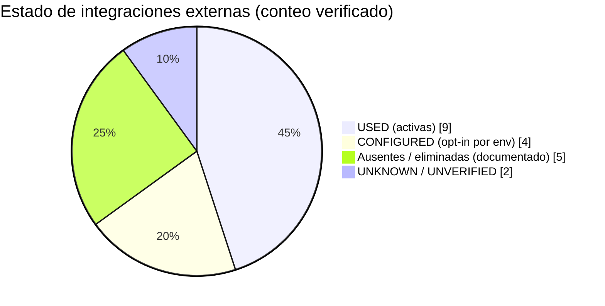

# Servicios externos e integraciones

**Estado:** implementado
**Método:** cada fila fue verificada en código (imports, `process.env.*`, workflows, `vercel.json`). Cuando algo no se pudo verificar se marca `UNKNOWN / UNVERIFIED`.
**Clasificación:** `USED` = integración activa en el código · `CONFIGURED` = implementada pero opt-in por configuración · `DOCUMENTED ONLY` = solo mencionada en docs · `UNKNOWN` = no verificable.

> Render: [diagramas/svg/servicios-externos.svg](diagramas/svg/servicios-externos.svg)

## Matriz de integraciones

| Servicio | Estado | Dónde se verifica | Variables / mecanismo |
| --- | --- | --- | --- |
| **PostgreSQL (Neon / Vercel Postgres)** | `USED` — **prod verificada 2026-10-01:** Neon gestionado por Vercel (proyecto `pancheria`, branch `main`, `neondb`, PG 17, `us-east-1`); URL con `neon.tech` → driver serverless. `/api/health` → `db: "up"` | `src/db/index.ts` (driver dual `pg` / `@neondatabase/serverless`), `drizzle.config.ts` | `DATABASE_URL` (o `POSTGRES_URL`, `POSTGRES_PRISMA_URL`), `DATABASE_URL_UNPOOLED`, `DATABASE_POOL_MAX`, `DATABASE_*_TIMEOUT_MS`. En CI E2E: `E2E_DATABASE_URL[_SHARD<N>]` sobre Neon descartable |
| **Vercel (hosting + functions)** | `USED` — prod verificada: último deploy `READY` desde `main`; proyecto en plan Hobby | `next.config.ts` (validación de build solo si `VERCEL`), `vercel.json` | `VERCEL`, `VERCEL_ENV` implícitos de plataforma |
| **Vercel Cron** | `USED` — endpoints prod verificados (`401` sin auth = desplegados + `withCronAuth`); evidencia indirecta de ejecución: `n_tup_del` en `public_order_rate_limits`/`order_messages` solo puede venir de `cleanupExpired`/`cleanupExpiredOrderMessages`. Confirmación definitiva = Cron Jobs tab del dashboard | `vercel.json` | `GET /api/cron/rate-limit-cleanup` y `GET /api/cron/chat-attachments-cleanup`, ambos `0 0 * * *`, `Bearer CRON_SECRET` |
| **GitHub Actions (scheduler)** | `USED` — verificado 2026-10-01: `VERCEL_PRODUCTION_URL` y `CRON_SECRET` existen y ~30 corridas `success`. **Frecuencia real ~4–8 veces/día** (los schedules `*/5` de GH Actions se throttlean), sin impacto gracias a la expiración lazy | `.github/workflows/expire-orders.yml` | Llama `GET /api/cron/expire-orders` (declarado `*/5 * * * *`) contra `${{ vars.VERCEL_PRODUCTION_URL }}` con `secrets.CRON_SECRET` |
| **GitHub Actions (CI)** | `USED` | `.github/workflows/ci.yml` | Jobs: cambios (gate `docs-only`: commits que solo tocan `.md`/`.devin/`/`docs/`/`LICENSE` saltan el resto), lint, typecheck, unit-tests, build, knip, audit, e2e (sharding opt-in `E2E_SHARDS`), e2e-report. `concurrency` por ref con `cancel-in-progress` |
| **Vercel Blob** | `USED` en producción — **verificado 2026-10-01:** `STORAGE_PROVIDER=vercel-blob`, `BLOB_READ_WRITE_TOKEN` y `BLOB_STORE_ID` presentes en `production`; store `pancheria-videos` (`iad1`, `public`) `Active` con 0 B (aún sin uploads reales) | `src/lib/storage.ts` (provider `vercel-blob`, import dinámico `@vercel/blob`) | `STORAGE_PROVIDER=vercel-blob` + `BLOB_READ_WRITE_TOKEN` |
| **AWS S3** | `CONFIGURED` (no activo en prod) | `src/lib/storage.ts` (provider `s3`, presigned POST vía `@aws-sdk/s3-presigned-post`) | `STORAGE_PROVIDER=s3` + `S3_ACCESS_KEY_ID`, `S3_SECRET_ACCESS_KEY`, `S3_BUCKET`, `S3_REGION`, `S3_ENDPOINT` |
| **Cloudflare R2** | `CONFIGURED` (no activo en prod) | `src/lib/storage.ts` (provider `r2`, mismo SDK S3, endpoint derivado de `R2_ACCOUNT_ID`) | `STORAGE_PROVIDER=r2` + `R2_ACCESS_KEY_ID`, `R2_SECRET_ACCESS_KEY`, `R2_BUCKET_NAME`, `R2_REGION` |
| **Filesystem local** | `USED` (dev/E2E) | `src/lib/storage.ts` provider `local`, `config/storage.ts` | `LOCAL_STORAGE_PATH`, `CHAT_LOCAL_STORAGE_PATH`. En producción queda **rechazado en build** (`assertVercelProductionEnv` en `next.config.ts` lanza si `STORAGE_PROVIDER=local`; verificado: el último deploy de prod es `READY` y el valor real es `vercel-blob`) |
| **Google Cast SDK** | `USED` | `src/hooks/useCast.ts`, `components/videos/cast-button.tsx`, `config/videos.ts` | `NEXT_PUBLIC_CAST_RECEIVER_APP_ID` (default `CC1AD845` = Default Media Receiver de Google), `NEXT_PUBLIC_CAST_SENDER_SDK_URL` (default `gstatic.com/…/cast_sender.js`) |
| **Vercel Analytics** | `CONFIGURED` | `src/components/conditional-analytics.tsx` + `config/analytics.ts` (inyección manual de `/_vercel/insights/script.js`; el paquete `@vercel/analytics` **no** está en `package.json`) | `NEXT_PUBLIC_ENABLE_VERCEL_ANALYTICS=true` + habilitar Analytics en el dashboard de Vercel |
| **Google Fonts** | `USED` | `src/app/layout.tsx` (`next/font/google`: Geist, Geist Mono) | Sin variables; descarga en build |
| **Google Maps** (embeds/links) | `USED` (solo URLs) | `src/lib/maps.ts` (`buildMapEmbedUrl`, `buildMapViewUrl`, `buildMapSearchUrl`, `buildMapCoordinatesUrl`, validación de URLs de ubicación) | Sin API key: solo se construyen URLs públicas de Google Maps para embeds/links. Sin SDK cargado |
| **Mercado Pago** | **AUSENTE** | Cero referencias en `src/`, `.env.example`, `README.md` (verificado por búsqueda exhaustiva) | Solo aparece como propuesta futura en `prompts/plan-implementacion-multi-tenant.md`. **No es una integración**: los pagos son `cash`/`transfer` registrados manualmente |
| **WhatsApp** | **ELIMINADO** | Sin código; el canal oficial de comunicación con el cliente es el chat del pedido (`order_messages`) | — |
| **Email / SMS** | **AUSENTE** | Sin nodemailer, twilio ni similares en `package.json` | — |
| **Redis / Upstash / KV** | **AUSENTE** | Rate limiting usa tabla `public_order_rate_limits`/`login_attempts` o memoria (`RATE_LIMIT_STORE_PROVIDER`, `PUBLIC_ORDER_RATE_LIMIT_STORE_PROVIDER` = `db|memory`; cualquier otro valor cae al default por entorno) | — |
| **Sentry / observabilidad SaaS** | **AUSENTE** | `src/lib/logger.ts` emite logs estructurados por consola (visibles en Vercel logs); `cloudflare-observability` u otros MCP no aplican al código | — |

## Crons — detalle operativo

| Endpoint | Disparador | Frecuencia | Qué hace |
| --- | --- | --- | --- |
| `GET /api/cron/expire-orders` | GitHub Actions `expire-orders.yml` | declarado cada 5 min; **observado ~4–8 veces/día** (throttling de schedules en GH Actions, verificado 2026-10-01) | `orderService.expirePendingOrders()`: cancela `pending` vencidos bajo `FOR UPDATE`, libera reservas legacy |
| `GET /api/cron/rate-limit-cleanup` | Vercel Cron (`vercel.json`) | diario 00:00 | Purga `public_order_rate_limits` expirados y `login_attempts` fuera de retención (`LOGIN_ATTEMPTS_RETENTION_MS`) |
| `GET /api/cron/chat-attachments-cleanup` | Vercel Cron (`vercel.json`) | diario 00:00 | `cleanupService`: archivos huérfanos en storage (adjuntos chat, imágenes producto, videos) + purga opt-in de mensajes (`ORDER_MESSAGES_RETENTION_DAYS`) |

Los tres usan `withCronAuth` (`src/lib/cron-handler.ts`): `Authorization: Bearer ${CRON_SECRET}` con comparación `timingSafeEqual`, `maxDuration = 300` (Hobby + Fluid Compute).

> Nota operativa recurrente (de `reporte-estado.md`): `VERCEL_PRODUCTION_URL` es repository **variable** de GitHub (no está hardcodeado). Si se cambia el dominio de producción hay que actualizar esa variable.

## Elementos verificados como ausentes

Para que futuras lecturas no los asuman: pasarela de pagos (Mercado Pago), notificaciones push/email/SMS, cache externo (Redis/KV), tracing/APM, feature flags remotos, WebSocket. Todo "tiempo real" es polling REST o SSE opt-in.

## `UNKNOWN / UNVERIFIED`

- **Devin Cloud / DRS:** el blueprint `environment.yaml` existe pero su verificación en Devin Cloud queda `UNKNOWN / UNVERIFIED` (marcado así en `reporte-estado.md`; requiere `devin auth login` + `devin.exe cloud drs blueprint-create --repo choy666/pancheria --from-file .devin/environment.yaml`). Se alineó a Node 22 (= CI; prod corre Node 24).
- **Costo del SSE en producción (baseline calculado, no medido):** por chat abierto, el polling actual (5 s) son ~720 invocaciones/h ≈ ~100 s de duración de función/h; con SSE, ~65 conexiones/h × 55 s (`CHAT_STREAM_BUDGET_MS`, `maxDuration=60`) ≈ ~3 600 s wall-clock/h pero ~27 polls internos por conexión (~1 770 queries DB/h vs ~720–1 440 del polling). Bajo Fluid Compute la espera idle no cobra CPU; el límite real es **concurrencia**: cada chat abierto mantiene 1 instancia de función ~55 s seguidos — con N chats simultáneos se reservan N instancias de forma continua. Con `orders` = 0 en prod el tráfico de chat es nulo hoy; habilitar es barato ahora pero escalar el diseño pide revisar `CHAT_STREAM_BUDGET_MS` y el límite de concurrencia del plan.

Volver al índice: [README.md](README.md)
