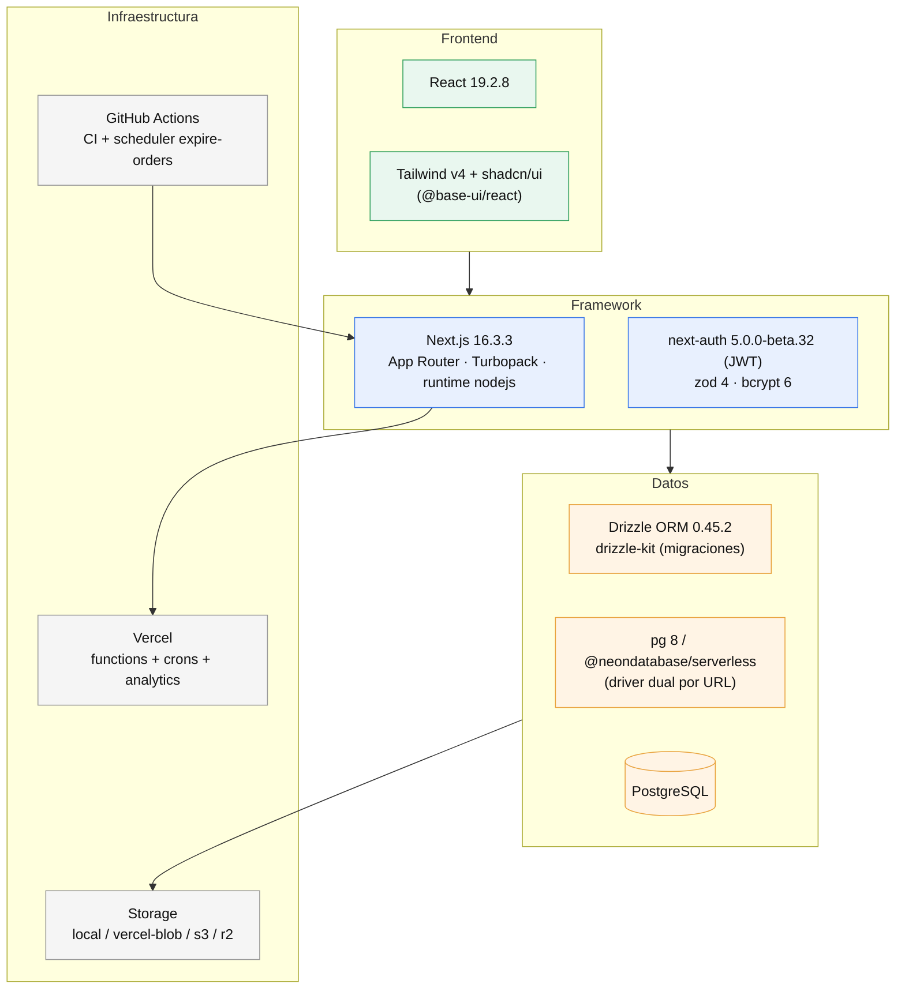

# Stack — tecnologías detectadas

**Estado:** implementado
**Fuente verificada en:** `package.json`, `drizzle.config.ts`, `next.config.ts`, `playwright.config.ts`, `jest.config.ts`, `tsconfig.json`, workflows

## Vista en capas

> Render: [diagramas/svg/stack.svg](diagramas/svg/stack.svg)

## Runtime y framework

| Pieza | Versión / detalle |
| --- | --- |
| Next.js | `^16.3.3` — App Router, Turbopack en dev (`next dev`), runtime `nodejs` en rutas API |
| React | `19.2.8` (`react`/`react-dom`) |
| Node.js | `>=20` (`engines`); CI usa Node 22 (`actions/setup-node@v4 node-version: 22`) |
| TypeScript | `^5` |
| Zod | `^4.4.3` — validación de payloads API (`src/lib/zod-schemas.ts`), locale `es` configurado en `api-handler.ts` |

## Datos

| Pieza | Versión / detalle |
| --- | --- |
| PostgreSQL | Neon / Vercel Postgres (serverless) |
| Drizzle ORM | `^0.45.2` + `drizzle-kit ^0.31.10` (migraciones en `drizzle/`, baseline `scripts/drizzle-baseline.ts`) |
| Drivers DB | `pg ^8.22.0` y `@neondatabase/serverless ^1.1.0` — elección en runtime por URL (`isNeonDatabase`) |
| bcrypt | `^6.0.0` — hash de contraseñas |

## Auth y seguridad

| Pieza | Detalle |
| --- | --- |
| NextAuth / Auth.js | `^5.0.0-beta.32` — estrategia `jwt`, provider `credentials`, `authorized` callback para route guard |
| CSP | Nonce por request en `src/proxy.ts` + `getCspHeader` (`src/lib/csp-helpers.ts`) |
| Rate limiting | Implementación propia: `login_attempts` (por usuario) + `public_order_rate_limits` (por scope+IP) o memoria; `timingSafeEqual` en `CRON_SECRET` |
| Validación de archivos | magic bytes (firma real) en `src/lib/storage.ts` |

## Storage de archivos

| Provider | Mecanismo |
| --- | --- |
| `local` | filesystem `LOCAL_STORAGE_PATH` (dev/e2e; prohibido en build de producción) |
| `vercel-blob` | `@vercel/blob ^2.8.0` (import dinámico) |
| `s3` / `r2` | `@aws-sdk/client-s3 ^3.1110.0` + `@aws-sdk/s3-presigned-post ^3.1110.0` (presigned POST) |

## Frontend

| Pieza | Detalle |
| --- | --- |
| Tailwind CSS | `^4` (`@tailwindcss/postcss`) + `tw-animate-css` |
| shadcn/ui | `^4.16.1` (CLI) sobre `@base-ui/react ^1.6.0` — componentes en `src/components/ui/` |
| Iconos | `lucide-react ^1.28.0` |
| Utilidades CSS | `class-variance-authority`, `clsx`, `tailwind-merge` |
| Tour guiado | `driver.js ^1.8.0` (`components/tour/`) |
| Dinero | `dinero.js ^2.0.2` + `src/lib/money.ts` |
| Fechas | `date-fns ^4.4.0` + helpers UTC en `src/lib/date.ts` |
| IDs | `nanoid ^6.0.1` (keys de storage / idempotencia) |

## Testing y calidad

| Pieza | Detalle |
| --- | --- |
| Jest | `^30.4.2` + `ts-jest`, `jest-environment-jsdom`, `@testing-library/react ^16.3.2` — tests unitarios colocados junto al código (`*.test.ts(x)`) |
| Playwright | `^1.62.1` — `tests/e2e`, sharding opt-in, `workers: 1`, proyecto `webkit` opt-in |
| Accesibilidad | `@axe-core/playwright ^4.13.0` (`npm run test:accessibility`) |
| ESLint | `^9` + `eslint-config-next 16.3.3` |
| Knip | `^6.32.2` — detección de código/dependencias muertas (`npm run knip`) |
| Bundle analyzer | `@next/bundle-analyzer 16.3.3` (`analyze` / `analyze:webpack`) |

## Infraestructura y despliegue

| Pieza | Detalle |
| --- | --- |
| Hosting | Vercel (functions Node.js, `maxDuration=300` en crons, `60` en streams de chat) |
| Crons | `vercel.json` (2 diarios) + GitHub Actions (expire-orders cada 5 min) |
| CI | GitHub Actions `ci.yml` — lint, tsc, jest, build, knip, audit, e2e |
| Observabilidad | logs estructurados propios (`src/lib/logger.ts`), `GET /api/health`, Vercel Analytics opt-in por script |
| Fonts | `next/font/google` (Geist, Geist Mono) |

## Overrides de npm

`package.json#overrides`: `esbuild ^0.25.12` (vía `@esbuild-kit/core-utils`), `nanoid ^3.3.18` forzado en `next` y `postcss` (compatibilidad CommonJS de nanoid v6 en el toolchain de Next).

## Devin

`environment.yaml` (DRS blueprint) + `scripts/` con `dev-e2e.ts` (levantar dev server con `.env.e2e`) y `drizzle-baseline.ts` (registrar migraciones ya aplicadas).

Volver al índice: [README.md](README.md)
